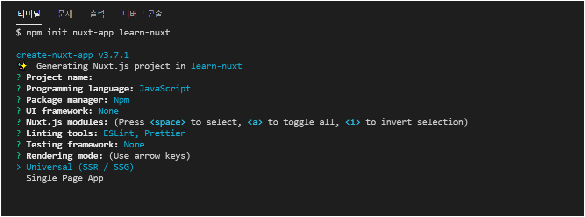
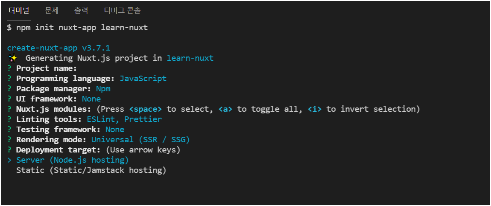
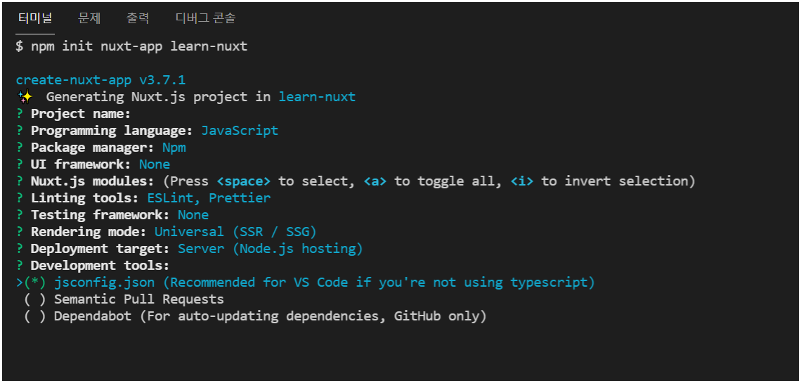
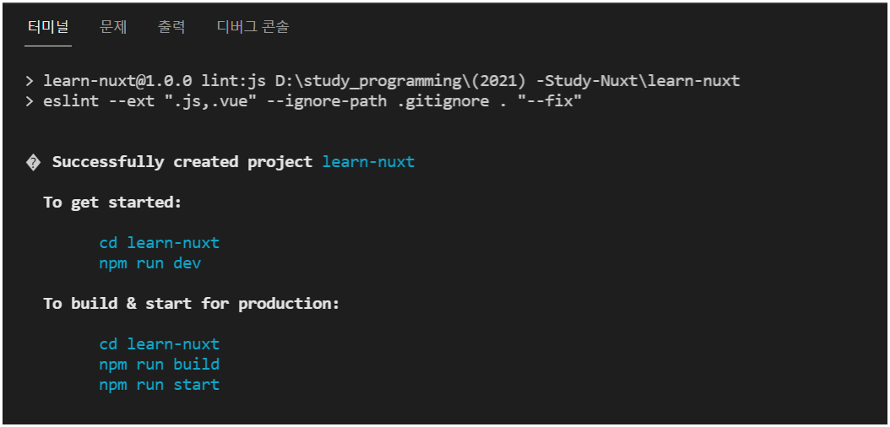
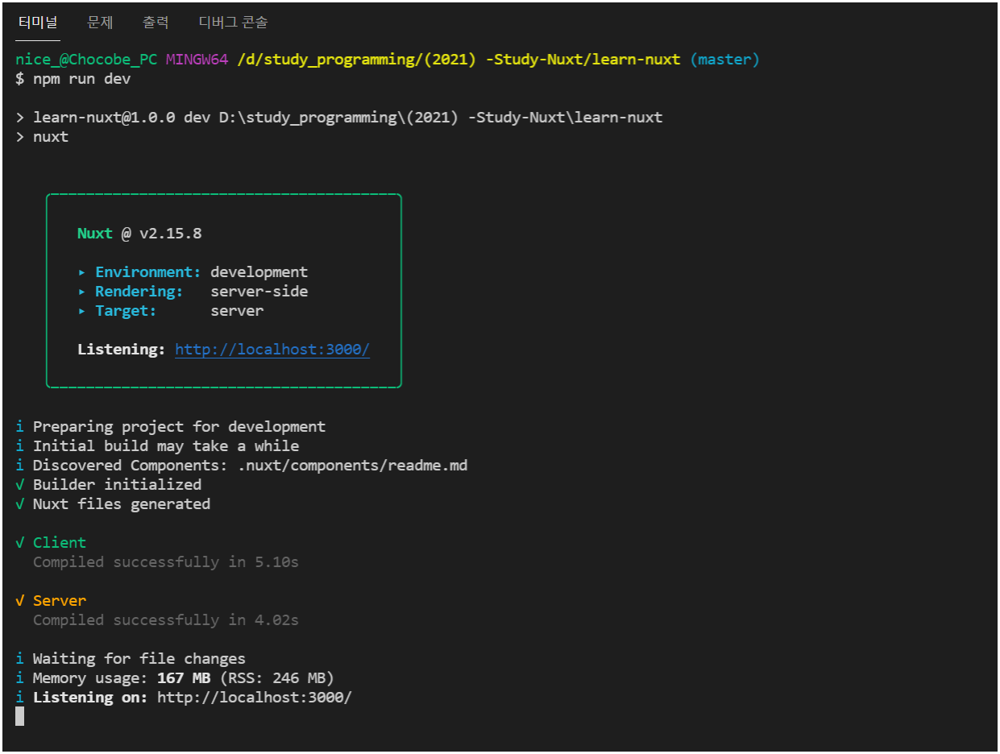
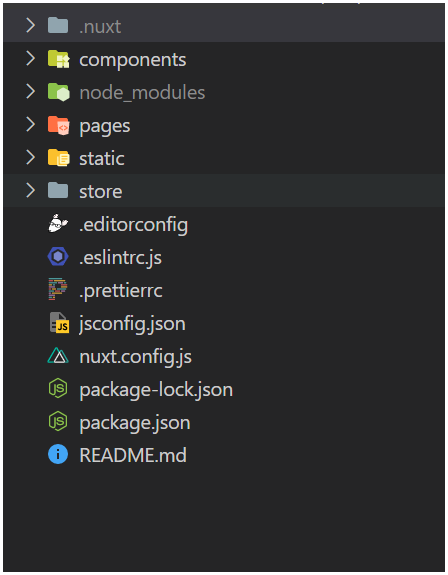

##### top
# -Study-Nuxt

* [01. ``Nuxt JS`` 프로젝트 생성하기](#01)

* [02. ``Nuxt JS``의 폴더 구조](#02)

* [03. 새로운 페이지 생성하기](#03)


<br/><hr/><br/>


* ``Nuxt JS``는 ``Vue`` 프레임워크를 사용한 ``Server Side Rendering Framework`` 입니다.
* ``Nuxt JS`` 프로젝트에는 ``Vuex``, ``Vue-Router``, ``Axios`` 등의 라이브러리들이 미리 구성하여 제공하고 있습니다.
* (이번 ``Nuxt JS`` 정리는 ``Vue JS``를 알고 있다는 전제하에 작성 하였습니다.)

<br/>

``Nuxt JS``를 사용하는 가장 큰 목적은 다음과 같습니다.

* 빠른 페이지 렌더링
* 검색엔진 최적화 (SEO)

<br/>

``Nuxt JS``를 사용할 때는 다음과 같은 사전지식이 필요 합니다.

* ``Node JS``에 대한 지식
* ``Server Side Rendering`` 에 대한 지식
* ``Back End``에 대한 지식

<br/>

``Nuxt JS``를 사용할 때 얻게 되는 장점은 다음과 같습니다.

* 검색엔진 최적화 (SEO)
* 초기 프로젝트 설정이 ``Vue`` 프로젝트에 비해 좀 더 다양하게 제공
* 파일기반(``.vue``) 라우팅 방식으로 동작하므로, 라우터 설정 X


<br/>

[🔺 Top](#top)

<hr/><br/>


##### 01
# 01. ``Nuxt JS`` 프로젝트 생성하기

> 공식홈페이지: [https://ko.nuxtjs.org/docs/2.x/get-started/installation](https://ko.nuxtjs.org/docs/2.x/get-started/installation)

<br/>

``Nuxt JS`` 프로젝트를 생성하기 위한 NPM 명령은 다음과 같습니다. 

(``Nuxt JS``에 대한 설치는 없이, ``NPM 프로젝트 생성 명령``으로 프로젝트를 생성 합니다)

```bash
npm init nuxt-app <프로젝트명>
```

<br/>

위 명령을 실행하면, 다음과 같은 프로젝트 생성 설정을 할 수 있습니다.

각 설정 단계에서 필요한 것들을 선택할 수 있는데, 설정 중 ``Rendering Mode``에는 다음과 같은 설정을 할 수 있습니다.

* ``Universal (SSR / SSG)``
* ``Single Page App``

``Universal (SSR / SSG)``의 경우, ``Server Side Rendering`` 또는 ``Static Site Generator`` 프로젝트가 생성 됩니다.

그리고, ``Single Page App``의 경우, 기존의 ``Vue``프로젝트 처럼 ``Client Side Rendering`` 프로젝트가 생성 됩니다.

그러므로, 현재는 ``Server Side Rendering`` 프로젝트를 위한 ``Nuxt JS``를 사용하기 위해, ``Universal`` 모드를 선택 합니다.

<br/>

<br/>

``Universal`` 모드 프로젝트를 선택하게 되면, ``배포 방식``을 설정하게 되는데, 현재 우리가 만들 프로젝트는 ``Server Side Rendering`` 이므로, ``Server (Node.js hosting)`` 을 선택 합니다.

<br/>

<br/>

다음 설정으로는 개발툴에 대한 설정을 할 수 있습니다. (``Development Tools``)

``VSCode``를 사용한다면, ``jsconfig.json``으로 설정하면 됩니다.

<br/>

<br/>

``Nuxt JS`` 프로젝트 생성이 완료되면, 다음과 같은 안내를 받을 수 있습니다.

<br/>

<br/>

``Nuxt JS``의 개발서버 실행은 ``dev`` 명령으로 설정되어 있습니다.

```bash
$ npm run dev
```

실행하게 되면 ``http://localhost:3000/`` 경로로 실행할 수 있습니다.

<br/>

<br/>

아래 이미지는 ``Nuxt JS`` 프로젝트를 생성한 직후의 실행 화면 입니다.

<br/>

<br/>

``Nuxt JS`` 프로젝트를 실행중에 소스코드가 변경되면, 해당 사항은 자동으로 반영되므로, 서버를 재실행할 필요는 없습니다.


<br/>

[🔺 Top](#top)

<hr/><br/>


##### 02
# 02. ``Nuxt JS``의 폴더 구조

<br/>

* ``.nuxt``: ``Nuxt JS`` 프로젝트 개발서버 실행 시, ``빌드결과물`` 폴더 입니다. (``.gitignore`` 설정상태)
* ``components``: ``Vue 컴포넌트`` 폴더
* ``pages``: ``Nuxt JS`` 프로젝트의 페이지용 ``Vue 컴포넌트`` 폴더
* ``static``: 정적 리소스 폴더
* ``store``: ``Vuex`` 폴더
* ``nuxt.config.js``: ``Nuxt JS`` 프로젝트 설정파일


<br/>

[🔺 Top](#top)

<hr/><br/>


##### 03
# 03. 새로운 페이지 생성하기

이제 새로운 페이지를 생성해 보겠습니다.

``Vue JS`` 프로젝트에서 새로운 페이지를 생성하기 위해서는 다음과 같은 과정이 필요 하였습니다.

1. ``.vue`` 파일 생성
2. ``router`` 연결

<br/>

``Nuxt JS`` 에서는 ``pages`` 폴더에 ``.vue`` 파일만 생성하면, 자동으로 ``router`` 연결까지 해줍니다.

자동 ``router`` 연결은, ``Nuxt JS``가 ``파일기반 라우팅``을 제공하기 때문입니다.

따라서, ``pages``에 생성한 모든 ``.vue``파일은 자신의 ``파일명``에 대한 ``router``까지 가지게 됩니다.

<br/>

그럼 현재 우리 ``Nuxt JS`` 프로젝트의 ``pages`` 폴더에 ``main.vue`` 파일을 생성하고, 간단한 마크업을 작성해 봅니다.

```html
<!-- 경로: ./src/pages/main.vue -->
<template>
  <div>
    <h1>메인 페이지 입니다.</h1>
  </div>
</template>

<script>
export default {
  //
}
</script>

<style scoped>
/*  */
</style>
```

<br/>

위와같이 ``pages`` 폴더에 ``main.vue`` 파일을 생성한 후, 브라우저에서 ``localhost:3000/main`` 으로 요청하면, 우리가 생성한 ``main.vue`` 가 라우팅 되는 것을 확인할 수 있습니다.

(만약, 자동 적용이 안된다면, 로컬서버 종료 후 다시 실행하면 적용 됩니다)

<br/>

<br/>

그렇다면, ``파일기반 라우팅``의 구조는 어떻게 되어 있는지 살펴 보겠습니다.

먼저 브라우저의 ``개발자 도구``에서 컴포넌트 구조를 살펴보면 다음과 같습니다.

<br/>

<br/>

``<.nuxtLayoutsDefault.vue>`` 컴포넌트의 하위에 ``<Nuxt>``가 있습니다.

그리고 우리가 ``main.vue``에 작성한 페이지 컴포넌트는 ``<Nuxt>`` 컴포넌트의 하위에 ``<PageMain.vue>`` 컴포넌트에 위치한 것을 알 수 있습니다.

이러한 구조는, 우리가 기존의 ``Vue`` 프로젝트에서 ``Layouts``컴포넌트를 기반으로 페이지를 구성하게 될 때, 이 구조와 동일하게 만들 수 있었습니다.

이를 ``Nuxt JS``에서는 ``Layouts 컴포넌트``를 ``숨김 컴포넌트``인 ``<.nuxtLayoutsDefault.vue>``컴포넌트와 ``<Nuxt>``컴포넌트로 제공하고, 우리가 ``pages`` 폴더에 만든 ``Vue 컴포넌트``를 ``router-view``로 출력해 주는 방식 입니다.

<br/>

위의 설명은 뭔가 장황하므로, 기존의 ``Vue`` 프로젝트의 ``router`` 형태로 보면 다음과 같습니다.

(아래의 소스코드는 ``Nuxt JS``의 로컬서버 실행 시 생성되는, ``/.nuxt/router.js`` 에서 확인할 수 있습니다.)

<br/>

<br/>

그리고 ``pages``에는 ``하위 라우트``를 만들수도 있습니다.

1. ``pages`` 폴더에 ``페이지 명``으로 ``폴더`` 생성
2. 생성한 ``폴더``에 ``index.vue`` 파일 생성 (기존의 ``@/pages/페이지명.vue``와 동일한 역할)
3. 동일한 폴더에 ``새로운 페이지명.vue`` 파일 생성 (``하위 라우트``가 됩니다)

<br/>

위와 같이 작성하였을 때 폴더구조는 다음과 같습니다.

<br/>

<br/>

<br/>


<br/>

[🔺 Top](#top)

<hr/><br/>


##### 04
# 04.