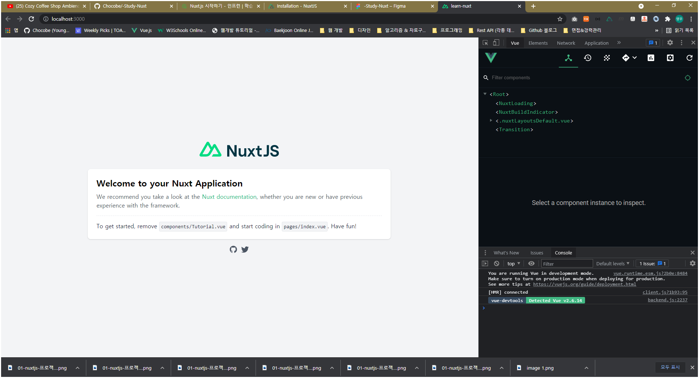

##### top
# -Study-Nuxt

* [01. ``Nuxt JS`` 프로젝트 생성하기](#01)

* [02. ``Nuxt JS``의 폴더 구조](#02)

* [03. 새로운 페이지 생성하기](#03)

* [04. 에러 페이지 만들기](#04)

* [05. ``layouts`` 구성하기](#05)

* [06. 페이지 이동을 위한 메뉴 (router-link) 만들기](#06)

* [07. Nuxt의 ``ESLint plugin`` 살펴보기](#07)

* [08. ``Server Side Rendering``에서의 ``데이터 Fetch``: ``asyncData()`` 라이프 사이클 훅](#08)


<br/><hr/><br/>


* ``Nuxt JS``는 ``Vue`` 프레임워크를 사용한 ``Server Side Rendering Framework`` 입니다.
* ``Nuxt JS`` 프로젝트에는 ``Vuex``, ``Vue-Router``, ``Axios`` 등의 라이브러리들이 미리 구성하여 제공하고 있습니다.
* (이번 ``Nuxt JS`` 정리는 ``Vue JS``를 알고 있다는 전제하에 작성 하였습니다.)

<br/>

``Nuxt JS``를 사용하는 가장 큰 목적은 다음과 같습니다.

* 빠른 페이지 렌더링
* 검색엔진 최적화 (SEO)

<br/>

``Nuxt JS``를 사용할 때는 다음과 같은 사전지식이 필요 합니다.

* ``Node JS``에 대한 지식
* ``Server Side Rendering`` 에 대한 지식
* ``Back End``에 대한 지식

<br/>

``Nuxt JS``를 사용할 때 얻게 되는 장점은 다음과 같습니다.

* 검색엔진 최적화 (SEO)
* 초기 프로젝트 설정이 ``Vue`` 프로젝트에 비해 좀 더 다양하게 제공
* 파일기반(``.vue``) 라우팅 방식으로 동작하므로, 라우터 설정 X


<br/>

[🔺 Top](#top)

<hr/><br/>


##### 01
# 01. ``Nuxt JS`` 프로젝트 생성하기

> 공식홈페이지: [https://ko.nuxtjs.org/docs/2.x/get-started/installation](https://ko.nuxtjs.org/docs/2.x/get-started/installation)

<br/>

``Nuxt JS`` 프로젝트를 생성하기 위한 NPM 명령은 다음과 같습니다. 

(``Nuxt JS``에 대한 설치는 없이, ``NPM 프로젝트 생성 명령``으로 프로젝트를 생성 합니다)

```bash
npm init nuxt-app <프로젝트명>
```

<br/>

위 명령을 실행하면, 다음과 같은 프로젝트 생성 설정을 할 수 있습니다.

각 설정 단계에서 필요한 것들을 선택할 수 있는데, 설정 중 ``Rendering Mode``에는 다음과 같은 설정을 할 수 있습니다.

* ``Universal (SSR / SSG)``
* ``Single Page App``

``Universal (SSR / SSG)``의 경우, ``Server Side Rendering`` 또는 ``Static Site Generator`` 프로젝트가 생성 됩니다.

그리고, ``Single Page App``의 경우, 기존의 ``Vue``프로젝트 처럼 ``Client Side Rendering`` 프로젝트가 생성 됩니다.

그러므로, 현재는 ``Server Side Rendering`` 프로젝트를 위한 ``Nuxt JS``를 사용하기 위해, ``Universal`` 모드를 선택 합니다.

<br/>

<br/>

``Universal`` 모드 프로젝트를 선택하게 되면, ``배포 방식``을 설정하게 되는데, 현재 우리가 만들 프로젝트는 ``Server Side Rendering`` 이므로, ``Server (Node.js hosting)`` 을 선택 합니다.

<br/>

<br/>

다음 설정으로는 개발툴에 대한 설정을 할 수 있습니다. (``Development Tools``)

``VSCode``를 사용한다면, ``jsconfig.json``으로 설정하면 됩니다.

<br/>

<br/>

``Nuxt JS`` 프로젝트 생성이 완료되면, 다음과 같은 안내를 받을 수 있습니다.

<br/>

<br/>

``Nuxt JS``의 개발서버 실행은 ``dev`` 명령으로 설정되어 있습니다.

```bash
$ npm run dev
```

실행하게 되면 ``http://localhost:3000/`` 경로로 실행할 수 있습니다.

<br/>

<br/>

아래 이미지는 ``Nuxt JS`` 프로젝트를 생성한 직후의 실행 화면 입니다.

<br/>

<br/>

``Nuxt JS`` 프로젝트를 실행중에 소스코드가 변경되면, 해당 사항은 자동으로 반영되므로, 서버를 재실행할 필요는 없습니다.


<br/>

[🔺 Top](#top)

<hr/><br/>


##### 02
# 02. ``Nuxt JS``의 폴더 구조

<br/>

* ``.nuxt``: ``Nuxt JS`` 프로젝트 개발서버 실행 시, ``빌드결과물`` 폴더 입니다. (``.gitignore`` 설정상태)
* ``components``: ``Vue 컴포넌트`` 폴더
* ``pages``: ``Nuxt JS`` 프로젝트의 페이지용 ``Vue 컴포넌트`` 폴더
* ``static``: 정적 리소스 폴더
* ``store``: ``Vuex`` 폴더
* ``nuxt.config.js``: ``Nuxt JS`` 프로젝트 설정파일

<br/>

다음 항목은 프로젝트상에는 없지만, ``Nuxt JS`` 프레임워크의 구조를 커스텀 할 수 있는 폴더 입니다.

``Nuxt JS`` 프로젝트를 생성하면, 처음에는 없는 폴더지만, 직접 폴더를 생성하고 ``Nuxt JS``에서 인식하는 파일명의 ``.vue`` 파일을 만든다면, 해당 요소를 커스터마이징 할 수 있습니다.

* ``layouts``: 이 폴더를 만든 후, ``default.vue`` 파일을 만들게 되면, ``기본 레이아웃``으로 사용하게 됩니다.
* ``middleware``: 페이지 요청 시에 필요한 선처리 로직을 설정할 수 있습니다. (``nuxt.config.js`` 설정 필요)
* ``plugins``: 외부 라이브러리(예: ``axios`` 등)을 설정하기 위한 폴더 입니다. (``nuxt.config.js`` 설정 필요)


<br/>

[🔺 Top](#top)

<hr/><br/>


##### 03
# 03. 새로운 페이지 생성하기

이제 새로운 페이지를 생성해 보겠습니다.

``Vue JS`` 프로젝트에서 새로운 페이지를 생성하기 위해서는 다음과 같은 과정이 필요 하였습니다.

1. ``.vue`` 파일 생성
2. ``router`` 연결

<br/>

``Nuxt JS`` 에서는 ``pages`` 폴더에 ``.vue`` 파일만 생성하면, 자동으로 ``router`` 연결까지 해줍니다.

자동 ``router`` 연결은, ``Nuxt JS``가 ``파일기반 라우팅``을 제공하기 때문입니다.

따라서, ``pages``에 생성한 모든 ``.vue``파일은 자신의 ``파일명``에 대한 ``router``까지 가지게 됩니다.

<br/>

그럼 현재 우리 ``Nuxt JS`` 프로젝트의 ``pages`` 폴더에 ``main.vue`` 파일을 생성하고, 간단한 마크업을 작성해 봅니다.

```html
<!-- 경로: ./src/pages/main.vue -->
<template>
  <div>
    <h1>메인 페이지 입니다.</h1>
  </div>
</template>

<script>
export default {
  //
}
</script>

<style scoped>
/*  */
</style>
```

<br/>

위와같이 ``pages`` 폴더에 ``main.vue`` 파일을 생성한 후, 브라우저에서 ``localhost:3000/main`` 으로 요청하면, 우리가 생성한 ``main.vue`` 가 라우팅 되는 것을 확인할 수 있습니다.

(만약, 자동 적용이 안된다면, 로컬서버 종료 후 다시 실행하면 적용 됩니다)

<br/>

<br/>

그렇다면, ``파일기반 라우팅``의 구조는 어떻게 되어 있는지 살펴 보겠습니다.

먼저 브라우저의 ``개발자 도구``에서 컴포넌트 구조를 살펴보면 다음과 같습니다.

<br/>

<br/>

``<.nuxtLayoutsDefault.vue>`` 컴포넌트의 하위에 ``<Nuxt>``가 있습니다.

그리고 우리가 ``main.vue``에 작성한 페이지 컴포넌트는 ``<Nuxt>`` 컴포넌트의 하위에 ``<PageMain.vue>`` 컴포넌트에 위치한 것을 알 수 있습니다.

이러한 구조는, 우리가 기존의 ``Vue`` 프로젝트에서 ``Layouts``컴포넌트를 기반으로 페이지를 구성하게 될 때, 이 구조와 동일하게 만들 수 있었습니다.

이를 ``Nuxt JS``에서는 ``Layouts 컴포넌트``를 ``숨김 컴포넌트``인 ``<.nuxtLayoutsDefault.vue>``컴포넌트와 ``<Nuxt>``컴포넌트로 제공하고, 우리가 ``pages`` 폴더에 만든 ``Vue 컴포넌트``를 ``router-view``로 출력해 주는 방식 입니다.

<br/>

위의 설명은 뭔가 장황하므로, 기존의 ``Vue`` 프로젝트의 ``router`` 형태로 보면 다음과 같습니다.

(아래의 소스코드는 ``Nuxt JS``의 로컬서버 실행 시 생성되는, ``/.nuxt/router.js`` 에서 확인할 수 있습니다.)

<br/>

<br/>

그리고 ``pages``에는 ``하위 라우트``를 만들수도 있습니다.

1. ``pages`` 폴더에 ``페이지 명``으로 ``폴더`` 생성
2. 생성한 ``폴더``에 ``index.vue`` 파일 생성 (기존의 ``@/pages/페이지명.vue``와 동일한 역할)
3. 동일한 폴더에 ``새로운 페이지명.vue`` 파일 생성 (``하위 라우트``가 됩니다)

<br/>

위와 같이 작성하였을 때 폴더구조는 다음과 같습니다.

<br/>

<br/>

<br/>


<br/>

[🔺 Top](#top)

<hr/><br/>


##### 04
# 04. 에러 페이지 만들기

``Nuxt JS`` 프로젝트를 생성하면, 기본 ``404 페이지``를 제공하고 있습니다.

<br/>

<br/>

기본 404 페이지의 UI는, 우리가 앞으로 만들 프로젝트의 UI와 일치할 가능성이 거의 없기 때문에 커스터마이징이 필요 합니다.

``Nuxt JS`` 프레임워크의 에러 페이지를 커스터마이징 하기 위해서는 다음과 같은 절차가 필요 합니다.

1. 루트 경로에 ``layouts`` 폴더 생성
2. ``layouts`` 폴더에 ``error.vue`` 파일 생성

<br/>

위와 같이 ``@/layouts/error.vue`` 파일을 생성하면, ``Nuxt JS`` 의 에러 페이지로 ``@/layouts/error.vue`` 파일을 사용하게 됩니다.

<br/>

```html
<!-- 경로: "@/layouts/error.vue" -->

<template>
  <div>
    <h1 class="error__title">
      🐫 404 커스텀 페이지 입니다.
    </h1>
  </div>
</template>

<script>
export default {
  //
}
</script>

<style scoped>
.error__title {
  color: #ff1493;
  font-size: 60px;
  font-weight: 900;
  text-align: center;
}
</style>
```

<br/>

위와 같이 작성한 후 로컬서버를 재실행 하면, ``404 커스텀 페이지``가 적용된 것을 확인할 수 있습니다.

<br/>

<br/>


<br/>

[🔺 Top](#top)

<hr/><br/>


##### 05
# 05. ``layouts`` 구성하기

``Nuxt JS`` 프레임워크의 레이아웃은 ``@/layouts/default.vue``를 사용하여 설정할 수 있습니다.

다음 이미지는 ``Nuxt JS`` 프레임워크의 ``layouts``와 ``pages``의 관계를 나타냅니다.

<br/>

<br/>

위의 이미지를 살펴보면, ``@/layouts/default.vue`` 파일이 ``layouts``으로 동작하며, 그 안에서 ``실제 페이지``가 출력됨을 알 수 있습니다.

따라서, 모든 페이지에서 공통으로 사용할 요소를 ``layouts``에서 구성요소로 작성한다면, 모든 페이지에 동일하게 적용시킬 수 있습니다.

<br/>

다음 코드는 ``@/layouts/default.vue`` 에 공통 컴포넌트로 ``<h1>{{ 페이지 명 }}</h1>``을 사용하는 예시 입니다.

```html
<!-- 경로: "@/layouts/default.vue" -->

<template>
  <div>
    <h1>{{ $route.name }} 페이지</h1>
    <Nuxt />
  </div>
</template>

<script>
export default {
  //
}
</script>

<style scoped>
/*  */
</style>
```

<br/>

위와 같이 구성하면, 모든 페이지에 ``<h1>{{ 페이지 명 }}</h1>`` 요소가 적용 됩니다.

<br/>

<br/>

<br/>

<br/>

그리고 하나 확인해야 할 부분은 ``<Nuxt />`` 태그 입니다.

``<Nuxt />`` 태그는 ``Vue 프로젝트``의 ``<router-view />``의 역할을 하게 됩니다.

따라서, ``@/layouts/default.vue`` 에서 각 페이지가 실제로 출력되는 부분이 ``<Nuxt />`` 태그 내부가 됩니다.


<br/>

[🔺 Top](#top)

<hr/><br/>


##### 06
# 06. 페이지 이동을 위한 ``메뉴 (router-link)`` 만들기

``Vue 프로젝트``에서 페이지 이동을 위한 ``메뉴``는 ``<router-link to="URI 경로" />``형식으로 만들었습니다.

``Nuxt JS`` 또한 페이지 이동을 위한 태그를 제공하는데, ``<NuxtLink to="URI 경로" />``형식으로 만들 수 있습니다.

<br/>

다음 코드는 ``@/layouts/default.vue``에 ``메뉴`` 기능을 추가한 예시 입니다.

```html
<!-- "@/layouts/default.vue" -->

<template>
  <div>
    <header>
      <h1>{{ $route.name }} 페이지 </h1>

      <nav>
        <ul class="menu">
          <li class="menu__item">
            <NuxtLink to="./">홈</NuxtLink>
          </li>

          <li class="menu__item">
            <NuxtLink to="/main">메인</NuxtLink>
          </li>

          <li class="menu__item">
            <NuxtLink to="/product">상품</NuxtLink>
          </li>
        </ul>
      </nav>
    </header>
  </div>
</template>

<script>
export default {
  //
}
</script>

<style scoped>
.menu {
  margin: 20px;
  list-style: none;

  display: flex;
  justify-content: flex-start;
  align-items: center;
}

.menu__item {
  margin-right: 20px;
}

.menu__item::last-child {
  margin-right: 0;
}
</style>
```

<br/>

<br/>


<br/>

[🔺 Top](#top)

<hr/><br/>


##### 07.
# 07. Nuxt의 ``ESLint plugin`` 살펴보기

Nuxt의 ESLint에는 ``eslint-plugin-nuxt`` 플러그인을 사용할 수 있습니다.

> Github) eslint-plugin-nuxt: [https://github.com/nuxt/eslint-plugin-nuxt](https://github.com/nuxt/eslint-plugin-nuxt)

<br/>

처음 ``Nuxt JS`` 프로젝트를 생성하면, 기본 플러그인으로 ``plugin:nuxt/recommended``가 설정되어 있습니다.

여기에는 ``fetch data`` 훅에서 ``setTimeout()`` 이나 ``setInterval()``을 제한하는 규칙만 제공하므로, 상당히 러프한 Lint가 됩니다.

(``fetch data hook``은 다음 챕터에서 자세히 알아보겠습니다.)

때문에, ESLint의 플러그인에 ``plugin:nuxt/base``를 함께 사용하게 되면, 좀 더 강력한 Lint를 사용할 수 있습니다.

<br/>

다음 코드는 ESLint 설정 파일의 ``plugins`` 설정 입니다.

```javascript
// 경로: root/.eslintrc.js

module.exports = {
  // ...생략...

  plugins: [
    "@nuxtjs",
    "plugin:nuxt/recommended",
    "plugin:nuxt/base",
    "prettier",
  ],

  // ...생략...
}
```

<br/>

위와 같이 ``plugin:nuxt/base`` 플러그인까지 설정하면, ``Nuxt JS``의 ``Data Fetch Hook`` 에서의 제약조건까지 에러를 띄워주기 때문에, 사소한 실수를 방지할 수 있습니다.

<br/>


<br/>

[🔺 Top](#top)

<hr/><br/>


##### 08
# 08. ``Server Side Rendering``에서의 ``데이터 Fetch``: ``asyncData()`` 라이프 사이클 훅

``Vue 프로젝트``에서는 데이터 fetch를 할 때, ``created()`` 또는 ``mounted()`` 라이프 사이클 훅에서 실행 하였습니다.

이는 ``Client Side Rendering`` 방식의 컵셉이기 때문에 적합한 방법이었지만, ``Nuxt JS``는 ``Server Side Rendering`` 방식이므로, 적합하지 않은 방법 입니다.

(물론 동작은 하지만, Server에서 ``template``과 ``데이터``를 조합한 상태로, 브라우저에 응답한다 는 컨셉에 위배됩니다.)

<br/>

먼저 ``Server Side Rendering``의 페이지 요청에 대한 응답방법을 간단히 알아보겠습니다.

1. Server에 페이지 요청
2. Server에서는 해당 페이지에 필요한 데이터를 ``Fetch``
3. ``Fetch``한 데이터와 해당 페이지를 조합
4. 조합된 페이지를 브라우저에 응답

<br/>

위와같은 흐름은 ``Nuxt JS``의 라이프 사이클 훅에서도 동일하게 반영되어 있습니다.

다음 이미지는 ``Nuxt JS``의 라이프 사이클 훅을 나타냅니다.

> 출처: Nuxt 공식홈페이지 [https://ko.nuxtjs.org/docs/2.x/concepts/nuxt-lifecycle](https://ko.nuxtjs.org/docs/2.x/concepts/nuxt-lifecycle)

<br/>

<br/>

<br/>

위의 이미지에서 라이프 사이클 훅 흐름을 보면 다음과 같습니다.

1. Nuxt Server 초기화
2. Route Middleware 실행 (Global => Layout => Page)
3. 유효성 검사 (``Boolean`` 반환 훅)
4. ``asyncData()`` 에서 데이터 ``Fetch`` 실행
5. ``Vue`` 라이프 사이클 실행

<br/>

즉, ``Vue`` 컴포넌트의 인스턴스를 생성하기 전에, ``asyncData()`` 훅에서 데이터를 ``Fetch``하고, 이후에 ``Vue`` 라이프 사이클 훅이 실행됨을 알 수 있습니다.

때문에, 우리는 페이지의 데이터를 ``Fetch``하기 위해, ``created()`` 또는 ``mounted()``가 아닌, ``asyncData()``을 사용하여 데이터를 ``Fetch``해야 합니다.

<br/>

다음 코드는 ``asyncData()`` 훅에서 데이터 ``Fetch`` 예시 입니다.

```html
<template>
  <div>
    {{ users }}
  </div>
</template>

<script>
import axios from "axios";
  
export default {
  // asyncData 라이프 사이클 훅
  async asyncData() {
    // 1. 데이터 조회
    const response = await axios.get("요청URL");

    // 2. Fetch데이터를 객체로 패킹하여 반환
    return {
      users: response.data,
    };
  },
}
</script>
```

<br/>

> asyncData 훅: [https://ko.nuxtjs.org/docs/2.x/features/data-fetching](https://ko.nuxtjs.org/docs/2.x/features/data-fetching)

위의 코드를 하나씩 살펴 보겠습니다.

<br/>

## 08-01. ``asyncData()`` 훅은 ``Pages`` 컴포넌트에만 사용 가능

``asyncData()`` 훅은, 페이지 요청 시에 새로운 페이지를 응답하기 위한 라이프 사이클에서 동작하기 때문에, ``pages`` 폴더 하위에 있는 ``Vue 페이지 컴포넌트`` 에서만 사용할 수 있습니다.

<br/>

## 08-02. ``asyncData()`` 내부에서는 ``this`` 사용불가

``Nuxt 라이프 사이클``을 통해서도 유추할 수 있듯이, ``asyncData()`` 훅이 실행되는 시점은 ``Vue 라이프 사이클``이 실행되기 전이므로, 아직 ``this``가 생성되기 이전 상태 입니다.

때문에, ``asyncData()`` 훅에서는 ``this``를 사용할 수 없습니다.

(``eslint-plugin-nuxt``의 ``plugin:nuxt/base`` 플러그인에서 이를 보조해 주고 있습니다.)

<br/>

## 08-03. ``asyncData()`` 에서 ``Fetch``한 데이터는 어떻게 사용하는가?

``asyncData()`` 훅에서 ``Fetch``한 데이터는 ``Object``로 패킹하여 반환하면, ``Vue 라이프 사이클`` 에서 ``data 속성``에 병합해 줍니다.

때문에, ``Fetch``한 데이터를 담기 위해, ``data 속성``을 만들지 않고, ``asyncData()`` 훅에서 ``반환한 속성명``으로 사용할 수 있습니다.

아래 코드는 ``asyncData()``에서 데이터 반환 예시 입니다.

```html
<template>
  <div>
    {{ users }}
  </div>
</template>

<script>
import axios from "axios";

export default {
  async asyncData() {
    const response = await axios.get("요청 URL");
    return {
      users: response.data,
    };
  },
}
</script>
```

<br/>

## 08-04. ``asyncData()`` 훅에서의 ``에러``는?

``asyncData()`` 훅은 ``Vue 라이프 사이클`` 전에 실행되기 때문에, ``asyncData()`` 훅에서 에러가 발생하면, 페이지 자체가 출력되지 않습니다.

이 경우, ``@/layouts/error.vue`` 컴포넌트가 출력 됩니다.

<br/>

## 08-05. 요약

지금까지 ``asyncData()`` 훅에 대한 요약을 하면 다음과 같습니다.

* ``pages`` 컴포넌트에만 사용 가능
* ``this`` 사용 불가
* 반환한 객체의 ``속성명``으로 ``<template>``에서 바로 사용
* ``asyncData()`` 훅에서 에러 발생 시, ``@/layouts/error.vue`` 페이지 출력


<br/>

[🔺 Top](#top)

<hr/><br/>


##### 09
# 09. 